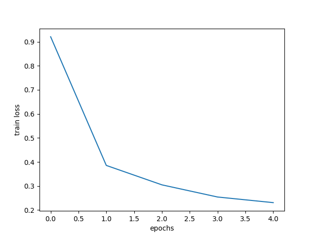
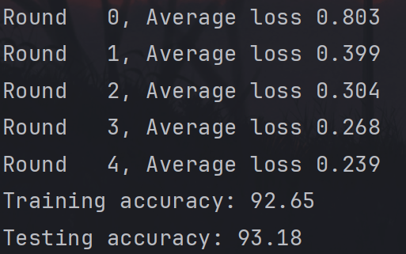
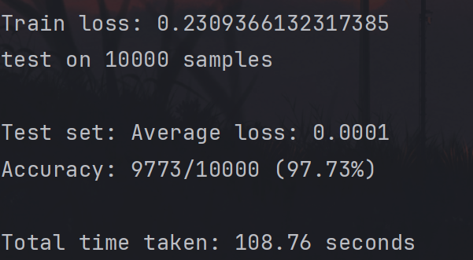
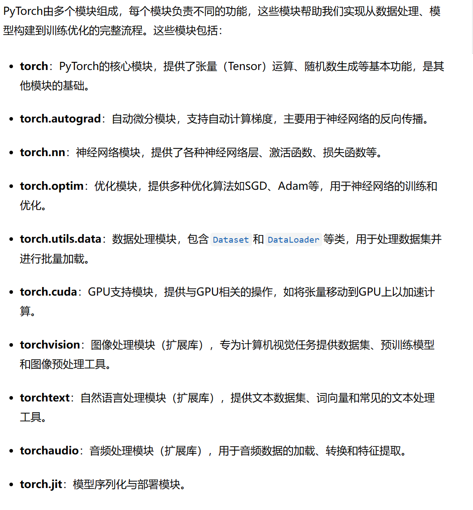

# Docker


## 1. 什么是 Docker？

**Docker** 是一种能让应用程序更容易开发、运行和部署的工具。传统上，我们在一台服务器上直接运行应用程序，但这容易造成“环境不一致”——例如，你的电脑和服务器可能有不同的操作系统或配置，导致应用在不同环境下运行不正常。

**Docker 解决方案**：Docker 将应用程序及其需要的所有环境打包在一个“容器”里。这个容器可以在任何支持 Docker 的地方运行，无论是在你自己的电脑上，还是在服务器上，应用都能保持相同的行为。

## 2. 为什么选择 Docker？

Docker 具有以下优点：

1. **内存和资源利用率**：与虚拟机相比，Docker 容器占用的内存和硬件资源更少。例如，传统虚拟机需要操作系统，可能要占用好几 GB 的内存，而 Docker 容器只需要应用的必要环境，占用几 MB 内存。
2. **启动速度快**：传统的操作系统启动会花费很多时间，容器则可以几秒内启动。这样一来，我们可以很快地启动、停止和重新部署应用程序，非常高效。

## 3. Docker 容器镜像和层次结构

**Docker 镜像**是用来创建容器的模板文件。可以把镜像看成应用的“代码”，而容器是运行这个代码的“实例”。镜像是分层的结构，Docker 通过分层设计提高了效率：

- **Bootfs**：引导文件系统，包含系统启动必需的文件。它只在系统启动时使用，启动后被卸载。
- **Rootfs**：根文件系统，包含应用运行所需的文件和配置。

镜像由多个只读层组成，运行容器时在镜像层上增加一个“写层”，使得镜像不变，容器可以对写层进行更改。

## 4. Docker 容器数据存储

Docker 容器默认是临时的，也就是当容器被删除时，其中的所有数据也会消失。为了保存数据，Docker 提供了两种方式：

- **数据卷（Volumes）**：独立于容器的数据存储位置，当容器删除后，数据卷仍然保留。
- **绑定挂载（Bind Mount）**：可以将主机系统上的目录直接挂载到容器里，方便文件的共享和备份。

## 5. Docker 常用命令

- **搜索镜像**：`docker search [镜像名称]` 可以在 Docker 仓库里搜索需要的镜像。
- **下载镜像**：`docker pull [镜像名称]` 下载指定镜像。
- **查看镜像**：`docker images` 列出下载的镜像。
- **创建并运行容器**：`docker run [选项] [镜像名称]` 基于指定镜像创建并启动一个容器。
- **查看容器**：`docker ps` 列出正在运行的容器，`docker ps -a` 列出所有（包括停止的）容器。

# 联邦学习基础知识学习

## 定义

是建立一个多个客户端共有的虚拟模型的过程，每个客户端在自己本地用自己持有的部分数据进行训练，经过加权合并后能让自己在不破坏隐私的情况下使用他们的数据。（数据不出本地来联合）

是一个**不用公布数据的合作共赢**技术。

## 分类

### 横向

相同特征、不同用户

### 纵向

相同用户、不同特征

### 迁移

用户和特征都不同，但共享目标相似的知识

## Fedavg

### 基础知识


#### 1. **FedAvg框架：**

FedAvg 是一种让多个用户（比如手机、电脑等）一起训练一个机器学习模型的方法。每个用户训练自己的模型，最终将他们的模型“合并”成一个更强大的模型。整个过程是这样的：

- **中心节点**（就像一个大管家）准备好一个模型，发给其他用户。
- **用户节点**（就像很多学生）在自己的设备上训练这个模型，得到自己的版本。
- 然后，用户们将训练好的模型发送回中心节点。
- **中心节点**将所有收到的模型合并，计算平均值（就像大家做作业后，老师把每个人的分数加起来算个平均值）。
- 这个过程一直重复，直到模型的准确度足够好。

#### 2. **数据集的分割：**

当你训练模型时，数据是分成训练集和测试集的。FedAvg 中有两种数据分割方式：

- **IID（独立同分布）**：意思是每个用户拿到的数据是相似的，就像每个学生做一样的作业，结果会有相似的答案。
- **Non-IID（非独立同分布）**：意思是每个用户拿到的数据不一样，比如有的学生只做数学作业，有的学生只做语文作业。

#### 3. **神经网络的前向传播和反向传播：**

- **前向传播**：就是将数据从输入端传递到输出端，模型给出预测的结果。比如，你给模型一张图片，它告诉你这张图片是猫还是狗。
- **计算损失**：前向传播结果可能不准确，所以你要计算模型的错误，叫做“损失”。
- **反向传播**：通过损失，模型会自己去学习，更新它的“知识”（权重），让它下一次做得更好。
- **梯度下降**：模型通过反向传播计算出的“方向”来修正自己的权重，逐渐减少错误。

#### 4. **SGD（随机梯度下降）：**

在训练时，我们不使用所有数据一次性计算损失，而是每次随机选一个数据来训练。这样可以更快地做出调整，就像你做作业时，先做一个问题，再做下一个问题。

#### 5. **FedAvg的伪代码分析：**

- **ClientUpdate(k, w)**：这是每个用户训练的过程。每个用户将自己的数据分成多个小批次，每次训练时，从一个批次中计算梯度并更新模型的权重。这个过程重复E轮，直到训练完成。
- **Server执行的过程**：中心节点会初始化一个模型，然后通过多轮选择不同的用户来训练。在每一轮，中心节点从所有用户中随机选择一部分，收集他们的训练结果（权重），然后把所有用户的训练结果做加权平均（根据每个用户的数据量来加权）。这样，就得到了更新后的模型。

总结来说，FedAvg 是一种分布式的训练方式，可以在保护隐私的情况下，让多个用户共同训练一个机器学习模型。
### FED与NN


### 代码实现(pycharm)

#### 具体逻辑

**每个迭代轮次本地更新 --> 复制参与本轮更新的 users 的所有权重 w_locals --> 通过定义的 FedAvg 函数求模型参数的平均 --> 分发到每个用户进行更新**

#### 训练轮次区别：

```
python main_fed.py --dataset mnist --iid --num_channels 1 --model cnn --epochs 5 --gpu 0
```




```
python main_fed.py --dataset mnist --iid --num_channels 1 --model cnn --epochs 20 --gpu 0
```


#### cnn与mlp区别：

```
python main_fed.py --dataset mnist --iid --num_channels 1 --model cnn --epochs 5 --gpu 0
```


``` 
python main_fed.py --dataset mnist --iid --num_channels 1 --model mlp --epochs 5 --gpu 0
```





#### fed和nn区别：


``` 
python main_nn.py --dataset mnist --iid --num_channels 1 --model cnn --epochs 5 --gpu 0
```


```
python main_fed.py --dataset mnist --iid --num_channels 1 --model cnn --epochs 5 --gpu 0
```


# 深度学习基础学习

## pytorch




### 解释部分

1. **`torch.Tensor`**：这是 PyTorch 中最基本的数据结构。你可以把它看作多维数组或矩阵，用于存储和操作数据。例如，一个二维的 Tensor 可以表示一张灰度图片。

2. **`torch.nn.Module`**：这是所有神经网络模块的基类。在自定义模型时，通常会继承这个类。常见的模块包括：

   - **`torch.nn.Linear(in_features, out_features)`**：全连接层，用于将输入特征映射到输出特征。
   - **`torch.nn.Conv2d(in_channels, out_channels, kernel_size)`**：卷积层，常用于图像处理。
   - **`torch.nn.ReLU()`**：一种激活函数，用于引入非线性。

3. **损失函数 (`torch.nn.functional`)**：用于衡量模型的预测与实际值之间的差距。常见的有：

   - **`torch.nn.CrossEntropyLoss()`**：用于分类任务的交叉界损失函数。
   - **`torch.nn.MSELoss()`**：用于回应任务的均方误差损失函数。

4. **优化器 (`torch.optim`)**：用于更新模型参数，使损失最小化。常见的有：

   - **`torch.optim.SGD(params, lr)`**：随机坚实下降优化器。
   - **`torch.optim.Adam(params, lr)`**：Adam 优化器。

   这些优化器常用的函数包括：

   - **`optimizer.zero_grad()`**：清零梯度。
   - **`optimizer.step()`**：更新模型参数。

5. **数据加载 (`torch.utils.data`)**：用于加载和处理数据集。

## CNN和MLP

CNN（卷积神经网络）和MLP（多层感知器）是两种常见的神经网络架构

### CNN

**CNN** 更适合处理图像数据，通过卷积层提取特征，池化层减少维度，结构更复杂但高效。

#### 结构

主要由 **卷积层（Conv）**、**池化层（Pooling）**、**Dropout 层** 和 **全连接层（FC）** 组成。

> 卷积层用于从图像中提取特征，池化层用于降低特征的维度和计算复杂度。

适合处理图像数据，能够捕捉空间结构特征。

### MLP

**MLP** 更简单，适用于结构较简单的任务，但没有卷积层提取局部特征的能力，处理图像时效果较差。

#### 结构

由多个 **全连接层（FC）** 组成。

>  每一层的每个神经元与前一层的每个神经元连接，处理的输入通常是展平的向量。

适合处理结构较简单的输入数据，通常用于分类、回归等任务。