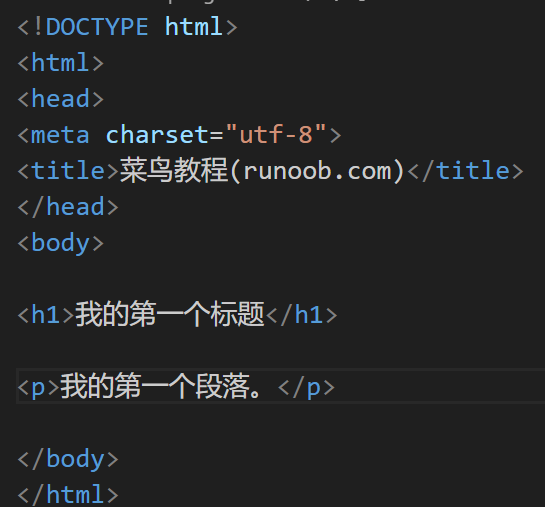
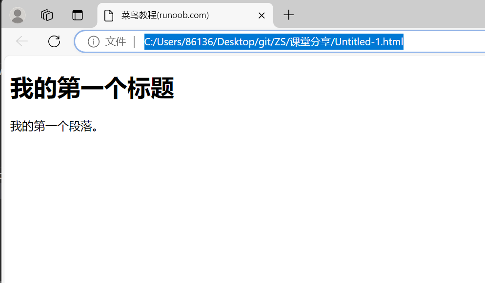
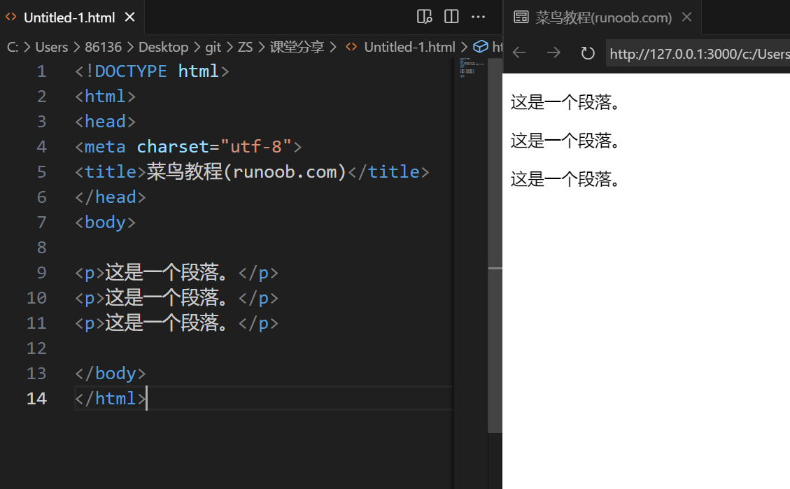
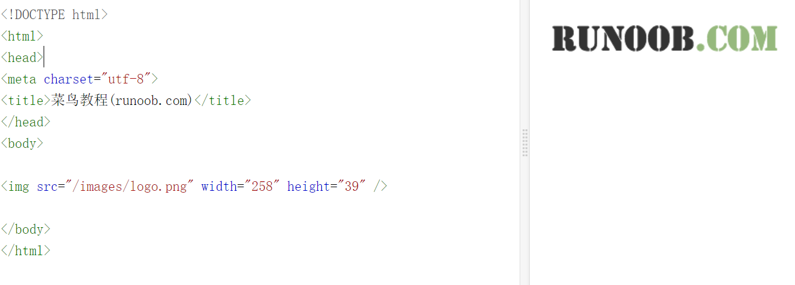

# HTML简介
超文本标记语言HyperText Markup Language，不是一种编程语言, 而是一种用于创建网页的标准标记语言。标记语言是一套标记标签 (markup tag)
HTML文档也叫做 web 页面
HTML 运行在浏览器上，由浏览器来解析。  

# HTML文档的后缀名 
.html
.htm  
以上两种后缀名没有区别，都可以使用。

# HTML标签
是由尖括号包围的关键词，比如 <html> 
HTML 标签通常是成对出现的，比如 <b> 和 </b>
标签对中的第一个标签是开始标签，第二个标签是结束标签，开始和结束标签也被称为开放标签和闭合标签  
基本格式：<标签>内容</标签>

# HTML元素
"HTML 标签" 和 "HTML 元素" 通常都是描述同样的意思. 
但是严格来讲, 一个 HTML 元素包含了开始标签与结束标签，
比如: HTML 元素: 
这是一个段落。

# Web浏览器
 Web浏览器（如谷歌浏览器，Internet Explorer，Firefox，Safari）是用于读取HTML文件，并将其作为网页显示。 浏览器并不是直接显示的HTML标签，但可以使用标签来决定如何展现HTML页面的内容给用户。
下面给出一个实例：

 

注意：对于中文网页需要使用 <meta charset="utf-8"> 声明编码，否则会出现乱码。有些浏览器(如 360 浏览器)会设置 GBK 为默认编码，则你需要设置为 <meta charset="gbk">。

 
# HTML网页结构 

只有 <body>区域 (白色部分) 才会在浏览器中显示。

# HTML标题
 HTML 标题（Heading）是通过h1-h6标签来定义的。

 
 

# HTML段落 
HTML 段落是通过标签 p来定义的。

 
# HTML链接
HTML 链接是通过标签 a来定义的。

 
提示:在 href 属性中指定链接的地址。

# HTML图像
HTML 图像是通过标签 img 来定义的.

注意： 图像的名称和尺寸是以属性的形式提供的

 
 
 

